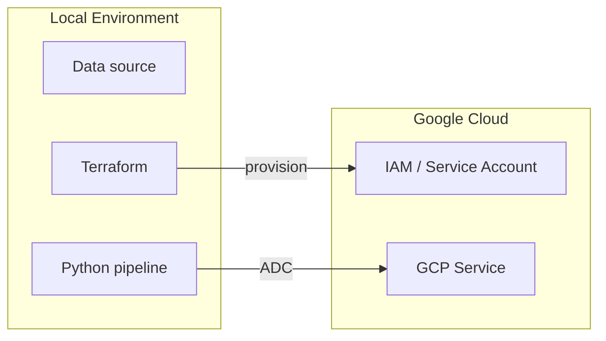

# GCP Data Engineering Project Skill

## When to use

- User asks to create a new GCP data engineering project or pipeline
- User wants to ingest, transform, or analyze data using GCP services
- User needs a portfolio-ready project with Terraform, Python, and open data

## Non-goals

- Do not use this for frontend or web application projects
- Do not create an entirely new repository; add a new folder to this repo
- Do not use paid data sources; always use open or public APIs

---

## Project conventions

### Repository layout

Every project is a self-contained folder at the root of this repository:

```text
introduction_data_engineering_gcp/
└── <project-name>/
    ├── app/                  # Python source code (optional, for services)
    │   └── <module>/
    │       ├── __init__.py
    │       ├── main.py
    │       └── requirements.txt
    ├── data/                 # Sample or seed data files (optional)
    ├── docker-compose.yml    # Local dev stack when applicable
    ├── docs/                 # Additional documentation (optional)
    ├── sql/                  # BigQuery SQL files when applicable
    ├── src/                  # Script-style Python when no service is needed
    ├── terraform/
    │   ├── main.tf
    │   ├── variables.tf
    │   ├── outputs.tf
    │   └── versions.tf
    ├── tests/
    ├── .gitignore
    ├── README.md
    └── run.sh
```

### Language and style

- All code, comments, variable names, and documentation in **English**
- Python 3.11+, `pyproject.toml` when packaging is needed
- No unnecessary abstractions; one function per clear responsibility
- Type hints on all public functions
- `set -Eeuo pipefail` on every shell script

### Terraform conventions

- One file per resource domain: `main.tf`, `variables.tf`, `outputs.tf`, `versions.tf`
- Always set `deletion_protection = false` and `delete_contents_on_destroy = true` on demo resources
- Always set `disable_on_destroy = false` on API enablement resources
- Use `depends_on` explicitly across resource domains
- Pin provider version with `~>` constraint
- Never commit `terraform.tfstate`, `terraform.tfvars`, or `.terraform/`
- Use `TF_VAR_*` environment variables instead of `.tfvars` files in `run.sh`

### Docker conventions

- Base image: `python:3.11-slim`
- Set `PYTHONDONTWRITEBYTECODE=1` and `PYTHONUNBUFFERED=1`
- Use `--timeout=120` on `pip install` inside Dockerfile to survive slow networks
- Use `docker-compose.yml` for local dev stacks with emulators or databases
- Do not store secrets in images or `docker-compose.yml`; use environment variables

### Open data sources

Prefer free and public APIs. Recommended options:

| Source | What it provides |
|--------|-----------------|
| [Open-Meteo](https://open-meteo.com/) | Weather: temperature, humidity, wind, precipitation |
| [NOAA](https://www.ncdc.noaa.gov/cdo-web/webservices/v2) | Historical climate data |
| [USGS Earthquakes](https://earthquake.usgs.gov/fdsnws/event/1/) | Real-time seismic events |
| [OpenAQ](https://docs.openaq.org/) | Air quality measurements |
| [NASA FIRMS](https://firms.modaps.eosdis.nasa.gov/) | Active fire / VIIRS data |
| [IBGE](https://servicodados.ibge.gov.br/api/docs) | Brazilian geographic and census data |
| [CoinGecko](https://www.coingecko.com/en/api) | Cryptocurrency market data |
| [Seaborn public datasets](https://github.com/mwaskom/seaborn-data) | CSV files for quick demos |

---

## run.sh template

Every project must have a `run.sh` that:
1. Accepts `GCP_PROJECT_ID` as env var or positional argument
2. Validates required commands before doing anything
3. Runs `terraform apply` to create resources
4. Executes the pipeline
5. Always runs `terraform destroy` via a `trap cleanup EXIT`

```bash
#!/usr/bin/env bash

set -Eeuo pipefail

ROOT_DIR="$(cd "$(dirname "${BASH_SOURCE[0]}")" && pwd)"
TERRAFORM_DIR="$ROOT_DIR/terraform"
VENV_DIR="$ROOT_DIR/.venv"
PROJECT_ID="${GCP_PROJECT_ID:-${1:-}}"
REGION="${GCP_REGION:-southamerica-east1}"

if [[ -z "$PROJECT_ID" ]]; then
  echo "Usage: GCP_PROJECT_ID=your-project-id ./run.sh"
  echo "   or: ./run.sh your-project-id"
  exit 1
fi

for cmd in terraform python3; do
  if ! command -v "$cmd" >/dev/null 2>&1; then
    echo "Required command not found: $cmd" >&2
    exit 1
  fi
done

export TF_VAR_project_id="$PROJECT_ID"
export TF_VAR_region="$REGION"

terraform -chdir="$TERRAFORM_DIR" init -input=false

cleanup() {
  local exit_status=$?
  trap - EXIT
  set +e
  echo
  echo "Destroying GCP resources..."
  terraform -chdir="$TERRAFORM_DIR" destroy -auto-approve -input=false
  local destroy_status=$?
  [[ $exit_status -ne 0 ]] && exit "$exit_status"
  exit "$destroy_status"
}

trap cleanup EXIT

echo "Creating GCP resources..."
terraform -chdir="$TERRAFORM_DIR" apply -auto-approve -input=false

# --- pipeline steps go here ---

echo "Pipeline completed successfully."
```

Adapt the pipeline section for each project. Add `docker build`/`docker push` steps
before `terraform apply` when the project uses Cloud Run.

---

## README template

Every project README must include:

1. **One-paragraph description** — what the project does and why it exists
2. **Cloud Architecture** — a Mermaid `flowchart LR` diagram showing all resources
3. **Resources** — bullet list of every GCP resource created
4. **Prerequisites** — tools, permissions, and auth steps
5. **Run** — exact commands to execute the project end to end
6. **Teardown note** — explain that `run.sh` destroys resources automatically

```markdown
# <Project Title>

<One-paragraph description of what the pipeline does and why.>

## Cloud Architecture



## Resources

- <List every GCP resource Terraform creates>

## Prerequisites

- Python 3.11+
- Terraform 1.6+
- A GCP project with billing enabled
- Application Default Credentials: `gcloud auth application-default login`

## Run

```bash
GCP_PROJECT_ID=your-project-id ./run.sh
```

Resources are destroyed automatically when the script finishes or fails.
```

---

## .gitignore template

```gitignore
# Python
__pycache__/
*.py[cod]
.venv/
.pytest_cache/
dist/
*.egg-info/

# Terraform
.terraform/
*.tfstate
*.tfstate.*
*.tfvars
.terraform.lock.hcl

# Environment and secrets
.env
.env.*
*.key.json

# OS
.DS_Store
```

---

## GCP services by use case

| Use case | Services |
|----------|---------|
| Batch ingestion to BigQuery | Cloud Storage, BigQuery, Cloud Run Jobs or Python script |
| Streaming ingestion | Pub/Sub, Dataflow, BigQuery |
| Scheduled pipeline | Cloud Scheduler, Cloud Run |
| Data transformation | BigQuery Scheduled Queries, dbt |
| Serving layer | BigQuery, Looker Studio |
| Secret management | Secret Manager |
| Container registry | Artifact Registry |

---

## Commit message convention

Use semantic prefixes in English:

| Prefix | When to use |
|--------|------------|
| `[feat]` | new pipeline, new resource, new service integration |
| `[fix]` | bug fix, Terraform correction, schema fix |
| `[chore]` | scaffold, CI, tooling, dependency updates |
| `[docs]` | README, architecture doc, runbook |
| `[refactor]` | code reorganization without behavior change |
| `[test]` | new or updated tests |

---

## Step-by-step execution

When creating a new project, follow this order:

1. Create the project folder with the layout above
2. Write `terraform/` files (providers, variables, resources, outputs)
3. Write `src/` or `app/` Python code
4. Write `run.sh` using the template above
5. Write `README.md` with the Mermaid architecture diagram
6. Validate: `terraform -chdir=terraform init -backend=false && terraform validate`
7. Validate: `python3 -m unittest discover -s tests` or `pytest`
8. Commit each layer separately with a semantic message
9. Run `GCP_PROJECT_ID=your-project-id ./run.sh` and capture evidence
10. Push to GitHub
