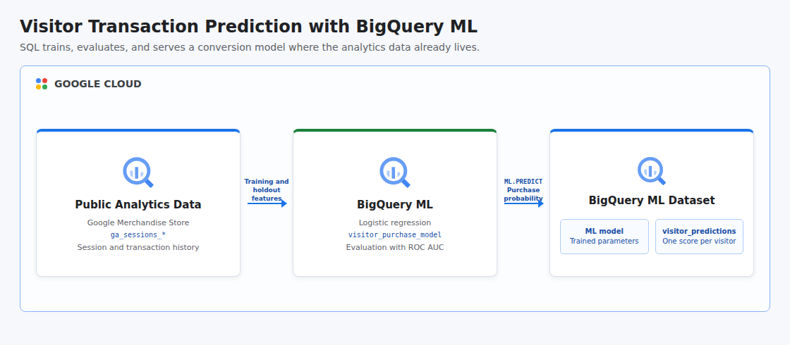

# Getting Started with BigQuery ML

This project recreates the Google Cloud BigQuery ML introductory lab as an automated, portfolio-ready machine learning workflow. It trains a logistic regression model directly in BigQuery on the public Google Analytics Sample dataset, evaluates transaction prediction quality on a later time window, scores visitors from a final holdout month, and persists one purchase probability per visitor without moving data to a separate ML platform.

## Cloud Architecture

[](docs/cloud-architecture.html)

BigQuery reads session features from the public Google Analytics dataset and trains the model in place. `ML.EVALUATE` measures performance on unseen dates, while `ML.PREDICT` scores July visitors and writes the resulting probabilities into a native BigQuery table.

## Resources

- BigQuery API
- BigQuery dataset named `bqml_ecommerce`
- Logistic regression model named `visitor_purchase_model`, created by the pipeline
- BigQuery table named `visitor_predictions`, containing one score per visitor

The model and prediction table are created inside the Terraform-managed dataset, so deleting the dataset removes every ML artifact. The shared BigQuery API remains enabled after teardown to avoid disrupting other workloads.

## Data Source

The workflow uses the public `bigquery-public-data.google_analytics_sample` dataset, which contains anonymized Google Merchandise Store sessions from August 2016 through August 2017. Training uses August 2016 through April 2017, evaluation uses May and June 2017, and prediction uses July 2017.

## Features and Label

The model learns from bounce count, time on site, page views, traffic source, traffic medium, device category, and visitor country. The binary label is `1` when a session contains at least one transaction and `0` otherwise. Automatic class weighting reduces the impact of the naturally imbalanced conversion label.

## Prerequisites

- Python 3.11 or newer with the `venv` module
- Terraform 1.6 or newer
- A Google Cloud project with billing enabled
- Application Default Credentials: `gcloud auth application-default login`
- Permissions to enable BigQuery, create datasets, run query jobs, and create BigQuery models and tables
- BigQuery processing quota and budget for querying the public sample dataset

## Run

```bash
chmod +x run.sh
GCP_PROJECT_ID="your-project-id" ./run.sh
```

The project ID can also be supplied as a positional argument:

```bash
./run.sh your-project-id
```

The source dataset is located in the BigQuery `US` multi-region, so the demo intentionally rejects other `GCP_LOCATION` values. The runner provisions the dataset, trains the model, checks that ROC AUC exceeds random classification, creates visitor predictions, and destroys all project-owned resources whether execution succeeds or fails.

Public dataset queries and model training can incur BigQuery processing charges. Review your project's billing controls before running the pipeline.

## Test

```bash
PYTHONPATH=. python3 -m unittest discover -s tests -v
terraform -chdir=terraform init -backend=false
terraform -chdir=terraform validate
```

## Concepts

| Concept | Definition + Use |
|---------|------------------|
| **Supervised Learning** | A model-training approach that learns from labeled examples, used here to learn transaction outcomes from historical sessions. |
| **Binary Classification** | A prediction task with two outcomes, used to estimate whether a visitor session will contain a transaction. |
| **Logistic Regression** | A classification algorithm that estimates class probabilities, implemented by BigQuery ML for interpretable purchase propensity scores. |
| **Feature Engineering** | Selecting and preparing predictive inputs, used to convert nested analytics fields into session, acquisition, device, and geography features. |
| **Temporal Holdout** | Evaluating on dates later than the training period, used to measure generalization without leaking future sessions into training. |
| **ROC AUC** | A ranking metric across classification thresholds, used to verify that the model discriminates purchasers better than random chance. |
| **Class Imbalance** | A label distribution where one outcome is much rarer, handled with automatic class weights because transactions are uncommon. |
| **In-Warehouse ML** | Training and scoring models where analytical data already resides, demonstrated with BigQuery SQL and no external model server. |