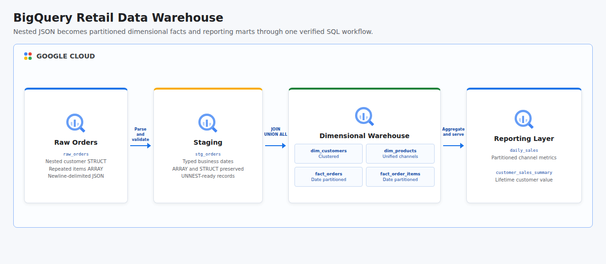

# BigQuery Retail Data Warehouse

This project combines four BigQuery warehouse labs into one end-to-end retail analytics workflow. It loads newline-delimited JSON with nested customers and repeated order items, transforms ARRAY and STRUCT fields, builds conformed dimensions and facts with JOINs and UNION ALL, creates date-partitioned and clustered tables, publishes reporting marts, and runs challenge-style assertions against row counts and partition metadata.

## Cloud Architecture

[](docs/cloud-architecture.html)

BigQuery receives nested retail orders in a raw table, preserves the repeated item structure in staging, and transforms the data through dimensional warehouse layers. Partitioned fact tables reduce date-filtered scan volume, while reporting tables and views expose daily sales and customer lifetime value.

## Four Labs In One Project

| Lab capability | Project implementation |
|----------------|------------------------|
| Creating a warehouse through JOINs and UNIONs | Conformed dimensions, joined fact tables, unified channel data, and reporting marts use `JOIN`, `LEFT JOIN`, and `UNION ALL`. |
| Creating date-partitioned tables | Order facts and daily sales are partitioned by business date and clustered by common filter keys. |
| Working with JSON, arrays, and structs | The Python loader ingests nested JSON; staging SQL accesses customer STRUCT fields and expands repeated item ARRAY values with `UNNEST`. |
| Data warehouse challenge | Automated assertions verify every warehouse layer and inspect `INFORMATION_SCHEMA.PARTITIONS`. |

## Resources

- BigQuery API
- BigQuery dataset named `retail_data_warehouse`
- Raw JSON table named `raw_orders`
- Nested staging table named `stg_orders`
- Customer and product dimensions named `dim_customers` and `dim_products`
- Date-partitioned facts named `fact_orders` and `fact_order_items`
- Date-partitioned reporting table named `daily_sales`
- Customer reporting view named `customer_sales_summary`

All tables and views live inside the Terraform-managed dataset. Destroying the dataset removes every warehouse artifact, while the shared BigQuery API remains enabled to avoid disrupting other workloads.

## Data Model

The seed dataset contains six orders across four dates and two sales channels. Customer is a nested record and items is a repeated record containing product, category, quantity, and price. The dimensional model produces four customers, six products, six order facts, and nine order-item facts.

```text
dim_customers ──< fact_orders >── fact_order_items >── dim_products
                       │
                       ├── daily_sales
                       └── customer_sales_summary
```

## Prerequisites

- Python 3.11 or newer with the `venv` module
- Terraform 1.6 or newer
- A Google Cloud project with billing enabled
- Application Default Credentials: `gcloud auth application-default login`
- Permissions to enable BigQuery, create datasets, load files, create tables and views, and run query jobs

## Run

```bash
chmod +x run.sh
GCP_PROJECT_ID="your-project-id" ./run.sh
```

The project ID can also be supplied as a positional argument. The location defaults to `US` and can be changed explicitly:

```bash
GCP_LOCATION="southamerica-east1" ./run.sh your-project-id
```

The runner provisions the dataset, creates a Python environment, loads nested JSON, executes the four SQL stages in order, validates warehouse counts and physical partitions, and destroys all Terraform-managed resources whether execution succeeds or fails. BigQuery load and query jobs can incur processing charges.

## Validation

Successful execution proves all challenge requirements:

- 4 conformed customers
- 6 conformed products
- 6 order facts
- 9 order-item facts produced by `UNNEST`
- 6 daily channel aggregates produced with JOIN and UNION ALL
- 4 physical date partitions in `fact_orders`

## Test

```bash
PYTHONPATH=. python3 -m unittest discover -s tests -v
python3 -m compileall -q src tests
bash -n run.sh
terraform -chdir=terraform init -backend=false
terraform -chdir=terraform validate
```

## Concepts

| Concept | Definition + Use |
|---------|------------------|
| **Data Warehouse** | A curated analytical store organized for reporting, implemented as raw, staging, dimensional, fact, and mart layers in BigQuery. |
| **Dimensional Modeling** | A design that separates descriptive dimensions from measurable facts, used for customers, products, orders, and order items. |
| **JOIN** | A relational operation that combines matching rows, used to connect dimensions, orders, items, and customer summaries. |
| **UNION ALL** | An operation that appends compatible result sets without deduplication, used to consolidate web and marketplace products and sales. |
| **Nested Data** | Hierarchical fields stored within a row, used for the customer STRUCT in each raw order. |
| **Repeated Data** | A list of values stored inside a row, used for order-item ARRAY values expanded with `UNNEST`. |
| **Date Partitioning** | Physical table segmentation by date, used to reduce scans when facts and reports are filtered by business date. |
| **Clustering** | Storage organization around frequently filtered columns, used for customer, channel, product, category, city, and segment keys. |
| **Conformed Dimension** | A consistent descriptive entity reused across facts, demonstrated by shared customer and product dimensions. |
| **Information Schema** | Metadata views describing warehouse objects, queried to verify the physical partitions created for order facts. |