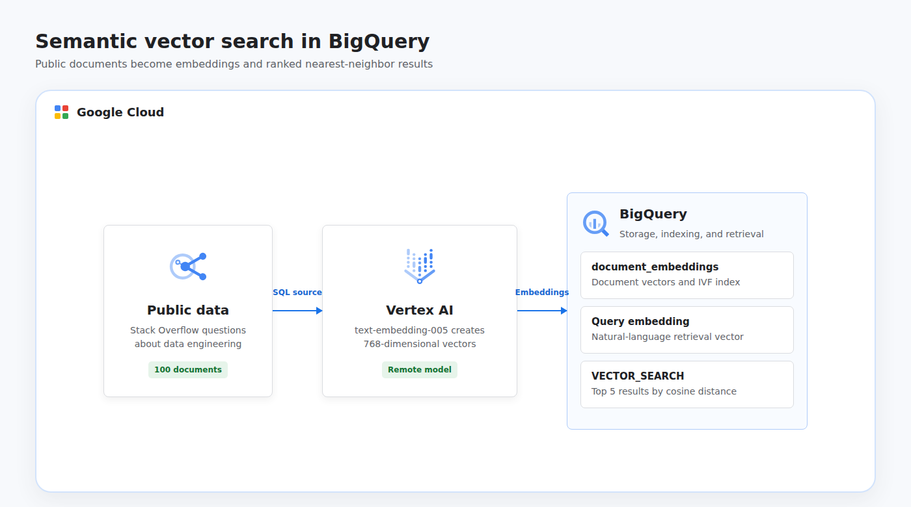

# Vector Search with BigQuery

This project recreates the BigQuery vector search lab as an automated, portfolio-ready semantic retrieval workflow. Terraform provisions a BigQuery dataset and managed Vertex AI connection; SQL selects public Stack Overflow questions, generates 768-dimensional embeddings with `text-embedding-005`, creates a vector index, embeds a natural-language query, and returns the five closest documents with BigQuery's `VECTOR_SEARCH` function.

## Cloud Architecture

[](docs/cloud-architecture.html)

BigQuery reads 100 highly scored questions related to BigQuery, Dataflow, Apache Beam, and ETL. A remote model delegates document and query embedding generation to Vertex AI through a managed connection identity. `VECTOR_SEARCH` ranks the stored vectors by cosine distance entirely inside BigQuery.

## Resources

- BigQuery, BigQuery Connection, and Vertex AI APIs
- BigQuery dataset named `vector_search_demo`
- BigQuery Cloud Resource connection named `vertex-ai-connection`
- Managed connection service account with `roles/aiplatform.user`
- BigQuery table named `documents` sourced from public Stack Overflow data
- BigQuery remote model named `embedding_model`
- BigQuery table named `document_embeddings` with 768-dimensional vectors
- IVF vector index named `document_embedding_index`

The dataset allows its contents to be deleted during teardown. Shared project APIs remain enabled after teardown to avoid disrupting other workloads.

## Data Source

The workflow uses [`bigquery-public-data.stackoverflow.posts_questions`](https://console.cloud.google.com/marketplace/product/stack-exchange/stack-overflow), selecting 100 highly scored questions tagged with BigQuery, Dataflow, Apache Beam, or ETL. HTML is removed from each body and input text is capped at 4,000 characters before embedding to keep the demonstration small and predictable.

## Prerequisites

- Python 3.11 or newer with the `venv` module
- Terraform 1.6 or newer
- A Google Cloud project with billing enabled
- Application Default Credentials: `gcloud auth application-default login`
- Permissions to enable APIs, manage BigQuery datasets and connections, grant IAM roles, create BigQuery models, and invoke BigQuery jobs
- Vertex AI embedding model availability and quota in the selected BigQuery location

## Run

```bash
chmod +x run.sh
GCP_PROJECT_ID="your-project-id" ./run.sh
```

The project ID can also be supplied as a positional argument. Override the default semantic query with `SEARCH_QUERY`:

```bash
GCP_PROJECT_ID="your-project-id" \
SEARCH_QUERY="How do I process streaming events with Apache Beam?" \
./run.sh
```

The dataset and connection default to the BigQuery `US` multi-region so they can read the public Stack Overflow table. The provider region defaults to `us-central1`:

```bash
GCP_PROJECT_ID="your-project-id" \
GCP_LOCATION="US" \
GCP_REGION="us-central1" \
./run.sh
```

The runner provisions the connection, creates the source table and remote model, generates document embeddings, creates an IVF index, embeds the query, and prints five ranked results with cosine distances. BigQuery can use exact brute-force search while an index is building or when a table is below its indexing threshold; `VECTOR_SEARCH` remains functionally correct in either case.

Resources are destroyed automatically when the script finishes or fails. Vertex AI embedding generation and BigQuery processing can incur small usage charges.

## Test

```bash
python3 -m venv .venv
.venv/bin/python -m pip install --requirement requirements.txt
.venv/bin/python -m unittest discover -s tests -v
terraform -chdir=terraform init -backend=false
terraform -chdir=terraform validate
```

## Concepts

| Concept | Definition + Use |
|---------|------------------|
| **Embedding** | A numeric vector representing semantic meaning, generated here for Stack Overflow documents and the search query. |
| **Semantic Search** | Retrieval based on meaning rather than exact keywords, implemented with query and document embedding similarity. |
| **Vector Search** | Nearest-neighbor retrieval over numeric vectors, performed by BigQuery's `VECTOR_SEARCH` table function. |
| **Cosine Distance** | A measure of vector orientation where smaller values indicate greater similarity, used to rank the five results. |
| **Vector Index** | A structure that accelerates approximate nearest-neighbor retrieval, created here as an IVF index on the embedding column. |
| **Remote Model** | A BigQuery model that delegates inference to another service, connecting SQL to Vertex AI `text-embedding-005`. |
| **Retrieval Task Type** | Model guidance that distinguishes indexed documents from search queries, applied with `RETRIEVAL_DOCUMENT` and `RETRIEVAL_QUERY`. |