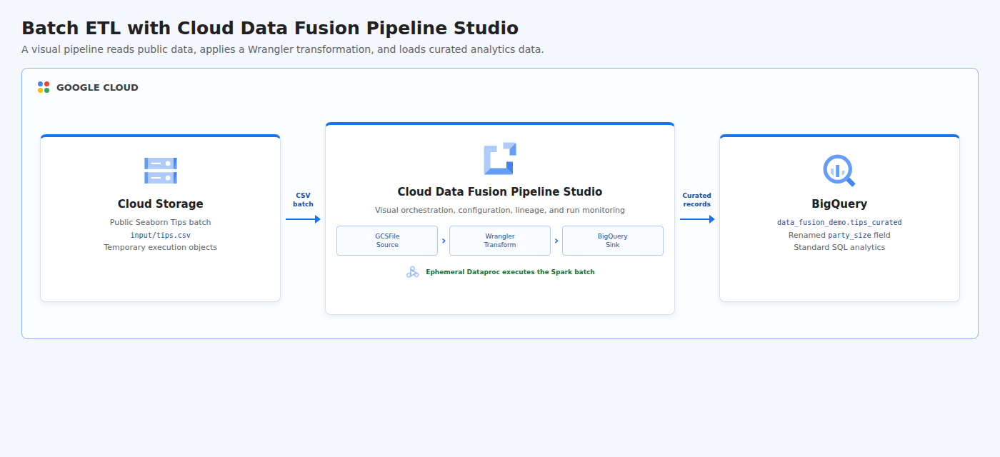

# Building Batch Pipelines in Cloud Data Fusion

This project automates a visual batch ETL pipeline in Google Cloud Data Fusion. It downloads the public Seaborn Tips dataset, stages it in Cloud Storage, deploys an importable Pipeline Studio definition through the CDAP API, transforms the `size` field into the clearer `party_size` field with Wrangler, and loads the curated 244-row result into BigQuery.

## Cloud Architecture

[](docs/cloud-architecture.html)

Cloud Data Fusion provides the visual design, deployment, lineage, and monitoring plane. The deployed batch pipeline uses managed GCSFile, Wrangler, and BigQuery plugins, while an ephemeral Dataproc cluster executes the Spark workload.

## Resources

- BigQuery, Compute Engine, Cloud Data Fusion, Dataproc, IAM, and Cloud Storage APIs
- BASIC Cloud Data Fusion instance named `batch-pipeline-studio`
- Cloud Storage bucket containing the source CSV and temporary execution data
- BigQuery dataset named `data_fusion_demo`
- `tips_curated` BigQuery table created by the pipeline sink
- Dedicated `data-fusion-pipeline` runtime service account
- Dataproc Worker and BigQuery Job User project roles for the runtime identity
- Bucket-level Object Admin and dataset-level Data Editor grants
- Service Account User grant for the Cloud Data Fusion service agent
- Pipeline Studio application named `tips-batch-etl`
- Ephemeral Dataproc cluster created and removed by the pipeline run

All persistent demo resources allow deletion. Shared project APIs remain enabled after teardown to avoid disrupting other workloads.

## Pipeline Stages

| Stage | Plugin | Behavior |
|-------|--------|----------|
| Cloud Storage Source | `GCSFile` | Reads the typed Tips CSV from a runtime `input_path` macro. |
| Wrangler Transform | `Wrangler` | Applies `rename size party_size` and emits the curated schema. |
| BigQuery Sink | `BigQueryTable` | Replaces the destination table using runtime dataset, table, bucket, and location macros. |

The generated `.work/pipeline.json` can also be imported into Pipeline Studio while the script is running, which exposes the same connected visual graph shown in the architecture diagram.

## Data Source

The project uses the open [Seaborn Tips dataset](https://github.com/mwaskom/seaborn-data), containing 244 restaurant transactions. Validation checks the row count, total bill value of `4827.77`, and maximum party size of six after the Data Fusion run.

## Prerequisites

- Python 3.11 or newer with the `venv` module
- Terraform 1.6 or newer
- Google Cloud CLI (`gcloud`)
- A Google Cloud project with billing enabled
- CLI authentication: `gcloud auth login`
- Application Default Credentials: `gcloud auth application-default login`
- Permissions to manage project APIs, Data Fusion instances, service accounts, IAM, Cloud Storage, BigQuery, Compute Engine, and Dataproc
- Permission to access the Cloud Data Fusion instance and invoke its CDAP API
- Sufficient regional Compute Engine quota for the ephemeral Dataproc execution cluster

## Cost And Runtime

Cloud Data Fusion is a billable service. A BASIC instance incurs charges while provisioned, and the Dataproc execution cluster adds compute charges during a run. Instance creation commonly takes 20 to 30 minutes and deletion can also take several minutes. The runner destroys resources automatically, but interrupting Terraform outside the script can leave the instance active; check the Cloud Data Fusion console after an interrupted run.

## Run

```bash
chmod +x run.sh
GCP_PROJECT_ID="your-project-id" ./run.sh
```

The project ID can also be supplied as an argument. The region and pipeline name are configurable:

```bash
GCP_REGION="us-central1" \
PIPELINE_NAME="tips-batch-etl" \
./run.sh your-project-id
```

The runner provisions the instance and supporting resources, uploads the source data, builds and deploys the Pipeline Studio JSON, starts the batch with CDAP runtime arguments, polls it to `COMPLETED`, and verifies BigQuery. Resources are destroyed automatically when the script finishes or fails.

## Test

```bash
PYTHONPATH=. python3 -m unittest discover -s tests -v
terraform -chdir=terraform init -backend=false
terraform -chdir=terraform validate
bash -n run.sh
```

## Concepts

| Concept | Definition + Use |
|---------|------------------|
| **ETL** | Extraction, transformation, and loading of data, implemented from Cloud Storage through Wrangler into BigQuery. |
| **Visual Pipeline** | A connected graph of configurable processing stages, represented by the importable Pipeline Studio definition. |
| **Batch Processing** | Processing a bounded dataset as one execution, used for the complete 244-row Tips file. |
| **Runtime Argument** | A value supplied when a pipeline starts, used to reuse one definition across input paths, datasets, tables, buckets, and locations. |
| **Schema Enforcement** | Explicit typing and naming of fields across stages, used to keep source, transform, and sink contracts aligned. |
| **Data Wrangling** | Interactive or declarative reshaping of data, used to rename `size` to the domain-specific `party_size`. |
| **Lineage** | Metadata describing how data moves through stages, captured by Data Fusion reference names and stage connections. |
| **Ephemeral Compute** | Temporary processing infrastructure created only for a workload, supplied by Dataproc for the Spark batch. |