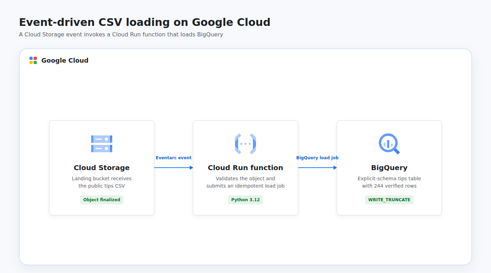

# Use Cloud Run Functions to Load BigQuery

This project recreates the event-driven Google Cloud lab as an automated, portfolio-ready pipeline. Terraform deploys a second-generation Cloud Run function, Eventarc trigger, Cloud Storage landing zone, and BigQuery destination; uploading the public restaurant tips CSV invokes the Python function, which runs an idempotent BigQuery load job and replaces the demo table with 244 validated rows.

## Cloud Architecture

[](docs/cloud-architecture.html)

A finalized CSV object in the landing bucket emits a direct Cloud Storage event through Eventarc. The Cloud Run function uses its dedicated service account to read the object and submit a BigQuery load job. Non-CSV objects are ignored, and event retries remain safe because each load uses `WRITE_TRUNCATE`.

## Resources

- Cloud Run Functions, Cloud Run, Eventarc, Cloud Build, Artifact Registry, Pub/Sub, Cloud Storage, and BigQuery APIs
- Cloud Storage source bucket containing the generated function ZIP
- Cloud Storage landing bucket for incoming CSV files
- BigQuery dataset named `cloud_run_function_demo`
- BigQuery table named `tips` with an explicit schema
- Second-generation Cloud Run function named `load-csv-into-bigquery`
- Direct Cloud Storage finalized-object Eventarc trigger
- Dedicated function service account
- Project-level BigQuery Job User and Eventarc Event Receiver grants
- Dataset-level BigQuery Data Editor and bucket-level Storage Object Viewer grants
- Pub/Sub Publisher grant for the Cloud Storage service agent

Demo buckets allow object deletion, and the BigQuery table has deletion protection disabled. Shared project APIs remain enabled after teardown to avoid disrupting other workloads.

## Data Source

The runner downloads the open [Seaborn tips dataset](https://github.com/mwaskom/seaborn-data/blob/master/tips.csv), containing 244 restaurant transactions with bill, tip, party, day, and meal attributes. Uploading `tips.csv` to the landing bucket is the only action needed to trigger the cloud pipeline.

## Prerequisites

- Python 3.11 or newer with the `venv` module
- Terraform 1.6 or newer
- A Google Cloud project with billing enabled
- Application Default Credentials: `gcloud auth application-default login`
- Permissions to enable APIs, deploy Cloud Run functions, manage Cloud Storage and BigQuery, create service accounts, and grant IAM roles

## Run

```bash
chmod +x run.sh
GCP_PROJECT_ID="your-project-id" ./run.sh
```

The project ID can also be supplied as a positional argument:

```bash
./run.sh your-project-id
```

The function and buckets default to `us-central1`; BigQuery uses the `US` multi-region. Override these values when required:

```bash
GCP_PROJECT_ID="your-project-id" \
GCP_REGION="us-central1" \
GCP_LOCATION="US" \
./run.sh
```

The runner packages and deploys the function, downloads the public CSV, uploads it to the landing bucket, and polls BigQuery until all 244 rows are visible. Cloud event delivery and function cold starts can make the final step take a few minutes.

Resources are destroyed automatically when the script finishes or fails. Terraform state remains local and contains resource metadata but no service account keys.

## Test

```bash
python3 -m venv .venv
.venv/bin/python -m pip install --requirement requirements.txt
.venv/bin/python -m unittest discover -s tests -v
terraform -chdir=terraform init -backend=false
terraform -chdir=terraform validate
```

## Concepts

| Concept | Definition + Use |
|---------|------------------|
| **Event-Driven Pipeline** | A pipeline started by a state change instead of a schedule, triggered here when Cloud Storage finalizes a CSV object. |
| **Serverless Function** | Code executed on managed infrastructure in response to an event, used here to submit a BigQuery load job without managing servers. |
| **Direct Event** | An event delivered from its source without an application-managed message topic, implemented with Cloud Storage and Eventarc. |
| **Load Job** | A BigQuery operation that ingests data from external storage, used to load the finalized CSV object efficiently. |
| **Idempotency** | The property that repeated processing produces the same result, achieved with `WRITE_TRUNCATE` for retried events. |
| **Least Privilege** | Granting only required access, applied through separate job, dataset, event receiver, and object viewer roles. |