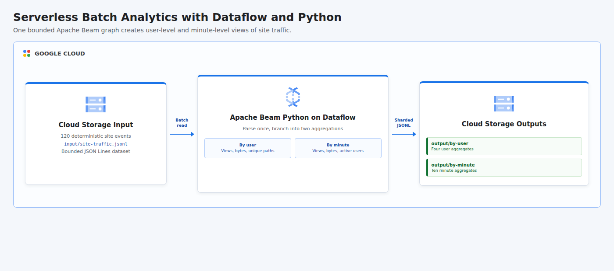

# Serverless Data Processing with Dataflow: Batch Analytics Pipelines with Python

This project implements the Python version of the Dataflow batch analytics lab. It generates 120 deterministic site-traffic events in Cloud Storage and runs one bounded Apache Beam graph on Dataflow that branches into two outputs: traffic aggregated by user and traffic aggregated by minute.

## Cloud Architecture

[](docs/cloud-architecture.html)

The source is parsed once and reused by both branches. The user branch calculates page views, bytes sent, and unique paths for each visitor; the minute branch calculates page views, bytes sent, and active users for each one-minute interval. Dataflow writes sharded JSON Lines results back to Cloud Storage.

## Resources

- Compute Engine, Dataflow, IAM, and Cloud Storage APIs
- Cloud Storage bucket containing input, output, staging, and temporary objects
- Dedicated `dataflow-batch-python` worker service account
- Dataflow Worker role for the worker identity
- Bucket-level Object Admin access for bounded reads and sharded writes
- Service Account User grant for the authenticated job submitter
- Temporary Apache Beam batch job executed by Dataflow

All persistent demo resources allow deletion. Shared project APIs remain enabled after teardown to avoid disrupting other workloads.

## Input And Outputs

The input contains 120 page-view events spaced five seconds apart across four users and five paths. This produces ten one-minute windows.

| Output | Rows | Metrics |
|--------|------|---------|
| `output/by-user` | 4 | Page views, bytes sent, and unique paths per user. |
| `output/by-minute` | 10 | Page views, bytes sent, and active users per minute. |

Verification reads every output shard and confirms that both perspectives preserve all 120 page views and the expected total of 114,000 bytes.

## Prerequisites

- Python 3.11 or newer with the `venv` module
- Terraform 1.6 or newer
- Google Cloud CLI (`gcloud`)
- A Google Cloud project with billing enabled
- CLI authentication: `gcloud auth login`
- Application Default Credentials: `gcloud auth application-default login`
- Permissions to manage project APIs, IAM, service accounts, Cloud Storage, and Dataflow
- Permission to act as the generated Dataflow worker service account
- Regional Compute Engine quota for Dataflow workers

## Run

```bash
chmod +x run.sh
GCP_PROJECT_ID="your-project-id" ./run.sh
```

The project ID can also be passed as an argument. Override the default region when needed:

```bash
GCP_REGION="us-central1" ./run.sh your-project-id
```

The runner provisions the bucket and worker identity, generates and uploads the site events, submits the Python Beam graph to Dataflow, waits for the bounded job to complete, and verifies both output prefixes. Resources are destroyed automatically when the script finishes or fails.

## Test

```bash
python3 -m venv .venv
.venv/bin/python -m pip install --requirement requirements.txt
PYTHONPATH=. .venv/bin/python -m unittest discover -s tests -v
terraform -chdir=terraform init -backend=false
terraform -chdir=terraform validate
bash -n run.sh
```

## Concepts

| Concept | Definition + Use |
|---------|------------------|
| **Bounded Data** | A dataset with a known finite size, represented by the 120 site-traffic events processed as one batch. |
| **Batch Processing** | Processing a complete bounded dataset before producing final results, executed by Apache Beam on Dataflow. |
| **Pipeline Branching** | Reusing one intermediate collection for multiple computations, used to derive user and minute perspectives from one parse step. |
| **Keyed Aggregation** | Grouping records by a business key before combining values, applied to user IDs and truncated event minutes. |
| **Parallel Output** | Independent sinks produced by one graph, implemented as two sharded JSON Lines prefixes in Cloud Storage. |
| **Serverless Compute** | Managed execution without maintaining a cluster, supplied by Dataflow for the Python Beam batch job. |