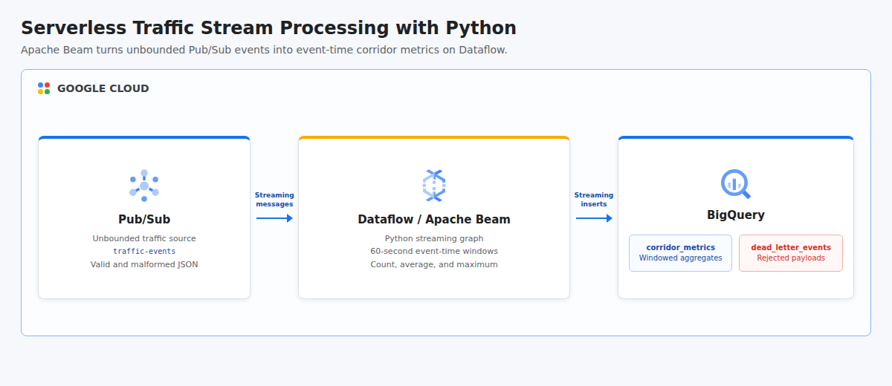

# Serverless Data Processing with Dataflow for Streaming in Python

This project recreates the Google Cloud Dataflow streaming lab as an automated, portfolio-ready Python pipeline. Synthetic traffic events enter Pub/Sub, an Apache Beam pipeline running on Dataflow validates and timestamps them, computes vehicle count plus average and maximum speed per corridor in 60-second event-time windows, writes incremental aggregates to BigQuery, and routes malformed messages to a dead-letter table.

## Cloud Architecture

[](docs/cloud-architecture.html)

Pub/Sub decouples event production from processing. Dataflow supplies serverless workers for the unbounded Beam graph, which applies event-time windows and early processing-time triggers before streaming aggregate rows into partitioned BigQuery storage.

## Resources

- BigQuery, Compute Engine, Dataflow, IAM, Pub/Sub, and Cloud Storage APIs
- Pub/Sub topic named `traffic-events`
- Cloud Storage bucket for Dataflow staging and temporary objects
- BigQuery dataset named `traffic_streaming`
- Partitioned and clustered `corridor_metrics` table
- `dead_letter_events` table for malformed or invalid payloads
- Dedicated `traffic-dataflow-worker` service account
- Scoped BigQuery, Dataflow, Pub/Sub, and Cloud Storage runtime roles
- Apache Beam streaming job submitted to Dataflow by the runner

All persistent demo resources allow deletion. Shared project APIs remain enabled after teardown to avoid disrupting other workloads.

## Event Model

The Python producer emits deterministic events for the `north`, `central`, and `south` corridors. Every event contains an ID, an ISO 8601 event timestamp, a corridor, and an integer speed in kilometers per hour. One intentionally invalid message proves that bad input is isolated instead of stopping the stream.

The Beam pipeline uses payload timestamps rather than worker arrival time. Each 60-second window groups events by corridor and computes:

- Vehicle count
- Average speed in kilometers per hour
- Maximum speed in kilometers per hour

An early trigger emits after 20 seconds of processing time so the demo can verify output without waiting for a long watermark cycle. The verification query selects the greatest count for each corridor, which prevents multiple trigger panes from inflating totals.

## Prerequisites

- Python 3.11 or newer with the `venv` module
- Terraform 1.6 or newer
- Google Cloud CLI (`gcloud`)
- A Google Cloud project with billing enabled
- CLI authentication: `gcloud auth login`
- Application Default Credentials: `gcloud auth application-default login`
- Permissions to manage APIs, IAM, service accounts, Pub/Sub, BigQuery, Cloud Storage, and Dataflow
- Permission to act as the generated Dataflow worker service account
- Regional Compute Engine quota for Dataflow workers

## Cost And Runtime

Dataflow workers, BigQuery streaming writes, and query processing are billable. The runner cancels the continuous Dataflow job before destroying infrastructure, but confirm cleanup in the Google Cloud console if the process is terminated externally or the machine loses connectivity.

## Run

```bash
chmod +x run.sh
GCP_PROJECT_ID="your-project-id" ./run.sh
```

The project ID can also be supplied as a positional argument. Adjust region or volume with environment variables:

```bash
GCP_REGION="us-central1" EVENT_COUNT="60" ./run.sh your-project-id
```

The runner provisions infrastructure, installs Python dependencies, submits the Beam graph, waits for Dataflow to reach the running state, publishes valid and invalid messages, verifies all three corridor aggregates and dead-letter routing, cancels Dataflow, and destroys every Terraform-managed resource automatically.

## Test

```bash
python3 -m venv .venv
.venv/bin/python -m pip install --requirement requirements.txt
PYTHONPATH=. .venv/bin/python -m unittest discover -s tests -v
terraform -chdir=terraform init -backend=false
terraform -chdir=terraform validate
bash -n run.sh
```

## Concepts

| Concept | Definition + Use |
|---------|------------------|
| **Unbounded Data** | A dataset that continues to receive records without a predefined end, represented by traffic events arriving through Pub/Sub. |
| **Stream Processing** | Continuous computation over events as they arrive, implemented by the Python Apache Beam graph on Dataflow. |
| **Event Time** | The time when an event occurred at its source, extracted from each payload to assign Beam timestamps. |
| **Fixed Window** | A finite interval used to divide an unbounded stream, configured here as non-overlapping 60-second periods. |
| **Trigger** | A rule controlling when a window emits results, used to provide an early aggregate after 20 seconds and later watermark-driven output. |
| **Watermark** | Beam's estimate of event-time completeness, used to decide when on-time window results can be emitted. |
| **Dead-Letter Path** | A separate output for records that fail normal processing, implemented with a BigQuery table for malformed messages. |
| **Streaming Insert** | Low-latency delivery of rows into BigQuery, used for both corridor metrics and rejected payloads. |