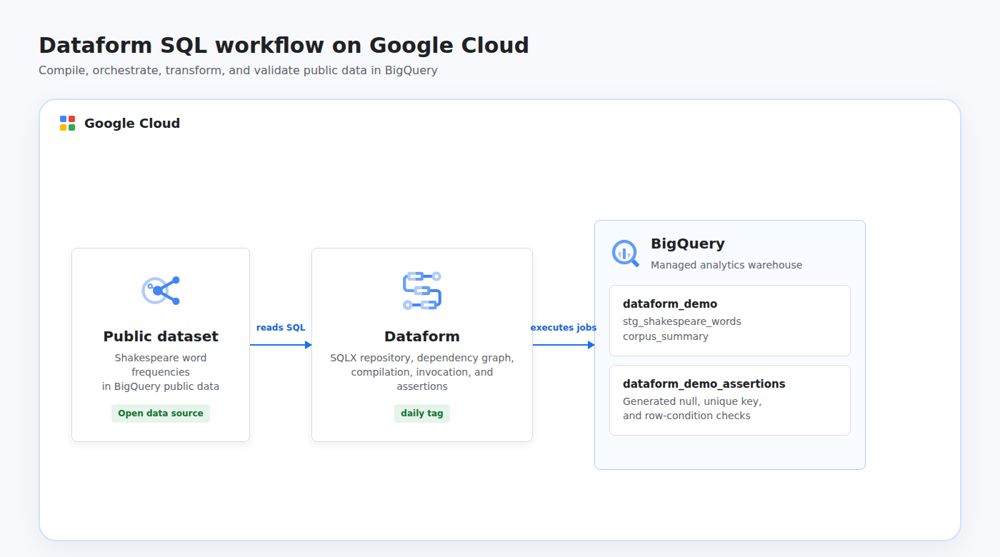

# Create and Execute a SQL Workflow in Dataform

This project turns the Google Cloud Dataform lab into an automated, portfolio-ready analytics workflow. Terraform provisions Dataform and BigQuery, Python publishes and executes SQLX definitions through the Dataform API, and the workflow transforms the public Shakespeare dataset into staged word data and per-corpus summaries with automated data quality assertions.

## Cloud Architecture

[](docs/cloud-architecture.html)

Dataform compiles the SQLX dependency graph and submits its actions to BigQuery. The staging table reads the public Shakespeare corpus, the summary table uses `ref()` to declare its dependency, and built-in assertions verify keys, nullability, and row conditions.

## Resources

- Dataform and BigQuery APIs
- Dataform repository named `sql-workflow`
- Dataform managed service identity
- Project-level `roles/bigquery.jobUser` grant for the Dataform identity
- BigQuery dataset named `dataform_demo`
- BigQuery assertion dataset named `dataform_demo_assertions`
- Dataset-level `roles/bigquery.dataEditor` grants for the Dataform identity
- Dataform workspace, compilation result, and workflow invocation created at runtime
- Staging and corpus summary tables plus generated assertion views

Both datasets allow their contents to be deleted during teardown. Shared project APIs remain enabled to avoid disrupting other workloads.

## Data Source

The workflow reads [`bigquery-public-data.samples.shakespeare`](https://console.cloud.google.com/marketplace/product/obfuscated-gaia-data/words), a public BigQuery table containing word frequencies from Shakespeare's works. The staging action keeps words appearing at least 100 times, limiting the transformed output while preserving useful aggregate results.

## Prerequisites

- Python 3.11 or newer with the `venv` module
- Terraform 1.6 or newer
- A Google Cloud project with billing enabled
- Application Default Credentials: `gcloud auth application-default login`
- Permissions to enable APIs, manage Dataform repositories and BigQuery datasets, grant IAM roles, and act as the Dataform service identity

## Run

```bash
chmod +x run.sh
GCP_PROJECT_ID="your-project-id" ./run.sh
```

The project ID can also be supplied as a positional argument:

```bash
./run.sh your-project-id
```

The default Dataform region is `us-central1`, while BigQuery uses the `US` multi-region to match the public dataset. Override them when necessary:

```bash
GCP_PROJECT_ID="your-project-id" \
GCP_REGION="us-central1" \
GCP_LOCATION="US" \
./run.sh
```

The runner provisions the cloud resources, renders project-specific workflow settings, writes each SQLX file to a Dataform workspace, compiles the graph, invokes all actions tagged `daily`, waits for success, and verifies that the summary table contains rows.

Resources are destroyed automatically when the script finishes or fails. Terraform state remains local and contains resource metadata but no service account keys.

## Test

```bash
python3 -m venv .venv
.venv/bin/python -m pip install --requirement requirements.txt
.venv/bin/python -m unittest discover -s tests -v
terraform -chdir=terraform init -backend=false
terraform -chdir=terraform validate
```

## Concepts

| Concept | Definition + Use |
|---------|------------------|
| **SQL Workflow** | An ordered graph of SQL transformations, implemented here as Dataform actions compiled and executed in BigQuery. |
| **Dependency Graph** | A directed graph that determines execution order, created with `ref()` between the staging and summary actions. |
| **Data Quality Assertion** | A SQL-based rule that fails the workflow when data violates expectations, used for null, uniqueness, and row-condition checks. |
| **Data Lineage** | The traceable relationship from source data to transformed outputs, represented by Dataform's compiled action dependencies. |
| **Compilation** | The process of resolving SQLX configuration and references into executable BigQuery SQL before invocation. |
| **Least Privilege** | Granting only the permissions needed for a workload, applied through job execution at project level and data editing on two dedicated datasets. |