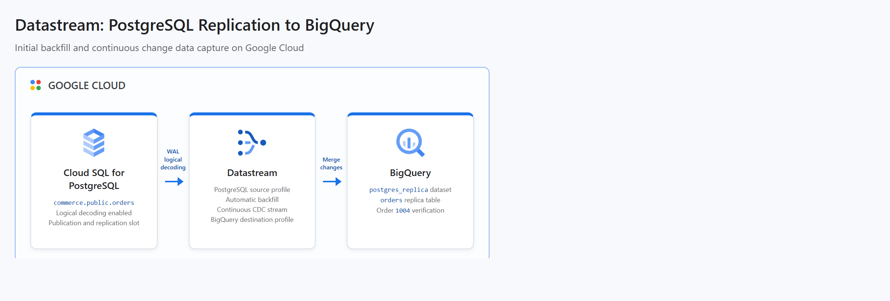

# Datastream: PostgreSQL Replication to BigQuery

This project demonstrates real-time change data capture (CDC) from PostgreSQL to BigQuery. Terraform creates a temporary Cloud SQL for PostgreSQL source, a BigQuery destination, Datastream connection profiles, and a running stream. Python initializes an `orders` table, publication, and logical replication slot, then inserts a new order and verifies that Datastream replicated it to BigQuery.

## Cloud Architecture

[](docs/cloud-architecture.html)

Datastream reads the initial table contents and subsequent changes from the PostgreSQL write-ahead log, then merges them into the BigQuery replica. Order `1004`, inserted after the stream starts, verifies that continuous change data capture is working.

## Resources

- Cloud SQL Admin, Datastream, and BigQuery APIs
- Cloud SQL for PostgreSQL 15 zonal instance with logical decoding enabled
- PostgreSQL `commerce` database and temporary database users
- BigQuery `postgres_replica` dataset
- Datastream PostgreSQL source connection profile
- Datastream BigQuery destination connection profile
- Datastream stream with automatic backfill and continuous CDC
- BigQuery Data Editor IAM grant for the Datastream service agent

The Cloud SQL firewall permits only the runner's detected public IPv4 address and the Datastream static IP addresses for the selected region. Generated database passwords are stored in local Terraform state, which is excluded by `.gitignore`.

## Prerequisites

- Python 3.11+ with the `venv` module
- Terraform 1.6+
- `curl`
- A GCP project with billing enabled
- Application Default Credentials with permission to manage APIs, Cloud SQL, Datastream, BigQuery, and project IAM

Authenticate locally:

```bash
gcloud auth application-default login
```

Cloud SQL and Datastream are billable services. The script uses a small zonal database and destroys all project resources after verification, but charges can still occur while the lab runs.

## Run

From this project directory:

```bash
GCP_PROJECT_ID="your-project-id" ./run.sh
```

The project ID can also be passed as an argument:

```bash
./run.sh your-project-id
```

To use another Datastream-supported region:

```bash
GCP_PROJECT_ID="your-project-id" GCP_REGION="us-east1" ./run.sh
```

The run has two provisioning phases. The first creates PostgreSQL and BigQuery so Python can configure the publication and replication slot. The second creates and starts Datastream, inserts order `1004`, and polls BigQuery until that CDC event is visible.

## Teardown

`run.sh` installs an exit trap before provisioning. It runs `terraform destroy` after success or failure, including when the script is interrupted. API services remain enabled because disabling shared project APIs could affect other workloads.

If the process is forcibly terminated before the trap runs, clean up manually:

```bash
export TF_VAR_project_id="your-project-id"
export TF_VAR_region="us-central1"
export TF_VAR_operator_cidr="127.0.0.1/32"
export TF_VAR_create_stream=true
terraform -chdir=terraform destroy -auto-approve
```

## Local Validation

```bash
terraform -chdir=terraform init -backend=false
terraform -chdir=terraform validate
python3 -m unittest discover -s tests -v
bash -n run.sh
```