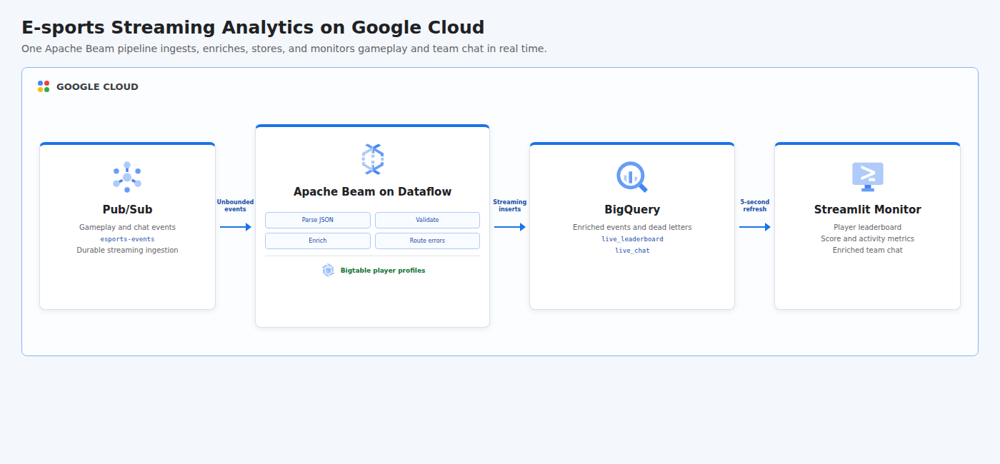

# E-sports Streaming Analytics with Apache Beam, Bigtable, BigQuery, and Streamlit

This project combines four e-sports streaming labs into one end-to-end platform. Synthetic gameplay and chat events enter Pub/Sub, an Apache Beam streaming pipeline on Dataflow validates them, enriches player identities from Bigtable, and writes analytics-ready events to BigQuery; a Streamlit monitor refreshes the live leaderboard and enriched team chat every five seconds.

## Cloud Architecture

[](docs/cloud-architecture.html)

The Beam graph is the central processing contract. Valid events receive low-latency Bigtable profile lookups before BigQuery streaming inserts, while malformed payloads are isolated in a dead-letter table. BigQuery views provide a stable serving layer for Streamlit.

## Combined Lab Coverage

| Lab Scenario | Implementation |
|--------------|----------------|
| Stream data with pipelines | Apache Beam defines parsing, validation, enrichment, routing, and output transforms. |
| Use Apache Beam and Bigtable to enrich data | A Beam `DoFn` looks up display name, team, region, and rank from Bigtable for every valid event. |
| Stream e-sports data with Pub/Sub and BigQuery | Pub/Sub supplies the unbounded source and BigQuery receives enriched events through streaming inserts. |
| Monitor e-sports chat with Streamlit | Streamlit reads the live chat and leaderboard views on a five-second refresh interval. |

## Resources

- BigQuery, Bigtable, Compute Engine, Dataflow, IAM, Pub/Sub, and Cloud Storage APIs
- Pub/Sub topic named `esports-events`
- Single-node SSD Bigtable instance with a `players` table and `profile` column family
- Four deterministic player profile rows used for stream enrichment
- Cloud Storage bucket for Dataflow staging and temporary objects
- BigQuery dataset named `esports_streaming`
- Partitioned and clustered `enriched_events` table
- `dead_letter_events` table for malformed messages
- `live_leaderboard` and `live_chat` serving views
- Dedicated `esports-dataflow-worker` service account with scoped runtime roles
- Apache Beam streaming job running on Dataflow
- Local Streamlit monitoring application named Arena Pulse

All persistent demo resources allow deletion. Shared project APIs remain enabled after teardown to avoid disrupting other workloads.

## Event Model

The producer emits deterministic gameplay and chat events for three matches and four fictional players. Gameplay actions include kills, assists, and objectives with score deltas; every third event is a chat message. Bigtable adds the player display name, team, region, and competitive rank before storage.

Malformed JSON and events missing required fields are written to `dead_letter_events` with their payload, failure reason, and timestamp instead of stopping the stream.

## Prerequisites

- Python 3.11 or newer with the `venv` module
- Terraform 1.6 or newer
- Google Cloud CLI (`gcloud`)
- A Google Cloud project with billing enabled
- CLI authentication: `gcloud auth login`
- Application Default Credentials: `gcloud auth application-default login`
- Permissions to manage APIs, IAM, service accounts, Pub/Sub, Bigtable, BigQuery, Cloud Storage, and Dataflow
- Permission to act as the generated Dataflow worker service account
- Regional Compute Engine quota for Dataflow workers

## Cost And Runtime

Bigtable and Dataflow are billable services. The project creates a single-node SSD Bigtable cluster and a continuously running Dataflow job, so do not leave an interrupted deployment active. The runner cancels Dataflow before Terraform destroys the resources, but confirm cleanup in the Google Cloud console after terminating the script externally.

## Run

```bash
chmod +x run.sh
GCP_PROJECT_ID="your-project-id" ./run.sh
```

The project ID can also be supplied as an argument. Configure the stream volume and dashboard window with environment variables:

```bash
GCP_REGION="us-central1" \
GCP_ZONE="us-central1-a" \
EVENT_COUNT="60" \
DASHBOARD_SECONDS="300" \
DASHBOARD_PORT="8501" \
./run.sh your-project-id
```

After verification, the runner starts Arena Pulse at `http://localhost:8501` for 60 seconds by default. Set `DASHBOARD_SECONDS=0` to skip UI startup or increase it to keep the monitor available longer. When the window closes, the script cancels Dataflow and destroys every Terraform-managed resource automatically.

## Streamlit Monitor

Arena Pulse displays active players, points scored, recent message count, a ranked player table, a score chart, and the latest enriched team chat. BigQuery views restrict both panels to the last hour, while `st.fragment(run_every="5s")` updates the content without reloading the full page.

## Test

```bash
python3 -m venv .venv
.venv/bin/python -m pip install --requirement requirements.txt
PYTHONPATH=. .venv/bin/python -m unittest discover -s tests -v
terraform -chdir=terraform init -backend=false
terraform -chdir=terraform validate
bash -n run.sh
```

## Concepts

| Concept | Definition + Use |
|---------|------------------|
| **Unbounded Data** | A continuously arriving dataset without a fixed end, represented by gameplay and chat events in Pub/Sub. |
| **Stream Processing** | Continuous transformation of events as they arrive, implemented with Apache Beam on Dataflow. |
| **Reference Data Enrichment** | Addition of stable descriptive attributes to event facts, performed through per-player Bigtable lookups. |
| **Dead-Letter Queue** | Isolation of records that cannot be processed normally, implemented as a BigQuery table for malformed messages. |
| **Serving View** | A curated query interface for downstream consumers, provided by the leaderboard and chat BigQuery views. |
| **Streaming Insert** | Low-latency row delivery into a warehouse table, used by Beam to make events queryable shortly after publication. |
| **Operational Monitoring** | Continuous presentation of current system or business activity, implemented by the auto-refreshing Streamlit dashboard. |