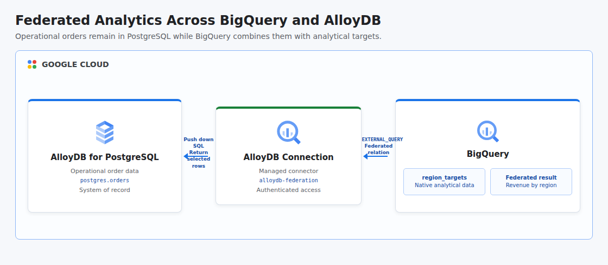

# Federated Query with BigQuery and AlloyDB

This project recreates the Google Cloud federated query lab as an automated, portfolio-ready analytics workflow. It stores live order data in AlloyDB for PostgreSQL, stores regional revenue targets in a native BigQuery table, creates an AlloyDB connection through the BigQuery Connector Framework, and runs one `EXTERNAL_QUERY` statement that joins both systems without copying the transactional table into the warehouse.

## Cloud Architecture

[](docs/cloud-architecture.html)

BigQuery pushes the PostgreSQL subquery through the managed AlloyDB connector and receives only the selected order columns. The outer query joins those rows with native BigQuery targets and calculates regional revenue, keeping each dataset in its owning system.

## Resources

- AlloyDB, BigQuery, BigQuery Connection, Compute Engine, and Service Networking APIs
- Dedicated VPC network, private services range, and service networking peering
- AlloyDB PostgreSQL 15 cluster with backups disabled for this temporary demo
- Zonal two-vCPU AlloyDB primary instance with temporary operator access
- BigQuery dataset named `federated_analytics`
- Native BigQuery table named `region_targets`
- BigQuery Connector Framework connection named `alloydb-federation`
- AlloyDB Client grant for the BigQuery Connection Service Agent

The AlloyDB cluster, instance, BigQuery resources, and networking are deleted automatically. Shared project APIs remain enabled after teardown to avoid disrupting other workloads.

## Sample Data

The project seeds five synthetic orders using notable computing pioneers as customer names. Regional reference data is stored separately in BigQuery so the final query demonstrates a real cross-system join rather than a remote-table-only read.

## Prerequisites

- Python 3.11 or newer with the `venv` module
- Terraform 1.6 or newer
- A Google Cloud project with billing enabled and sufficient AlloyDB quota
- Application Default Credentials: `gcloud auth application-default login`
- Permissions to enable APIs and manage AlloyDB, BigQuery connections, VPC networking, service networking, and BigQuery resources
- A network that permits outbound TLS connections to the temporary AlloyDB public endpoint

## Run

```bash
chmod +x run.sh
GCP_PROJECT_ID="your-project-id" ./run.sh
```

The project ID can also be supplied as a positional argument:

```bash
./run.sh your-project-id
```

The default region is `us-central1`. The AlloyDB instance and BigQuery connection must remain colocated, so override both through the single environment variable:

```bash
GCP_PROJECT_ID="your-project-id" GCP_REGION="southamerica-east1" ./run.sh
```

Provisioning AlloyDB can take several minutes and incurs charges while the instance exists. The runner detects the operator's public IPv4 address, provisions the resources, seeds both systems, executes the federated query, verifies four regions and five orders, then destroys all demo resources whether execution succeeds or fails.

Terraform state remains local and contains the generated database credential in plaintext because the BigQuery connection API requires it. The state is ignored by Git and removed with the rest of the local Terraform working data when cleaned manually.

## Test

```bash
PYTHONPATH=. python3 -m unittest discover -s tests -v
terraform -chdir=terraform init -backend=false
terraform -chdir=terraform validate
```

## Concepts

| Concept | Definition + Use |
|---------|------------------|
| **Query Federation** | A query model that reads an external system without first loading its data into the warehouse, implemented with BigQuery `EXTERNAL_QUERY` over AlloyDB. |
| **Query Pushdown** | Executing filtering and projection near the source system, used by the PostgreSQL statement inside `EXTERNAL_QUERY` to return only required order columns. |
| **Cross-System Join** | Combining records owned by different platforms, used to join AlloyDB orders with native BigQuery regional targets. |
| **Data Virtualization** | Presenting remote data through a unified query interface, allowing BigQuery SQL to analyze AlloyDB rows as a temporary relation. |
| **Operational Analytics** | Analyzing current transactional data with analytical context, demonstrated by comparing live order revenue with warehouse targets. |
| **Data Locality** | Keeping data in the system best suited to own it, with transactions remaining in AlloyDB and analytical reference data remaining in BigQuery. |