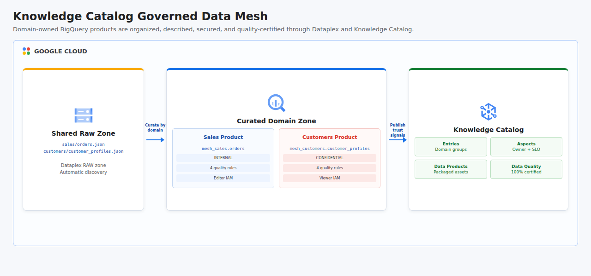

# Knowledge Catalog Governed Data Mesh

This project combines the Knowledge Catalog Qwik Start, custom aspects, catalog security, data quality, and challenge labs into one automated data mesh. Dataplex organizes shared raw data and curated BigQuery domain assets, Knowledge Catalog publishes owned sales and customer data products with mandatory governance aspects, domain-scoped IAM limits catalog and dataset access, and on-demand data quality scans publish trusted results back to the catalog.

> As of April 10, 2026, Dataplex Universal Catalog is named Knowledge Catalog. Google Cloud APIs, Terraform resources, client endpoints, and IAM roles retain the `dataplex` name.

## Cloud Architecture

[](docs/cloud-architecture.html)

The lake separates a shared raw Cloud Storage zone from curated domain datasets. Sales and customers own independent BigQuery products, catalog entry groups, metadata aspects, IAM policies, and quality contracts while remaining searchable through one Knowledge Catalog experience.

## Five Labs In One Project

| Lab capability | Project implementation |
|----------------|------------------------|
| Knowledge Catalog Qwik Start | Creates a Dataplex lake, raw and curated zones, one Cloud Storage asset, and two BigQuery assets. |
| Create and add aspects | Defines a required `domain-governance` aspect containing domain, owner, classification, and quality SLO metadata. |
| Implement catalog security | Separates catalog entry groups and BigQuery datasets by domain, with optional editor and viewer IAM members. |
| Assess data quality | Runs eight Dataplex rules for completeness, uniqueness, validity, email format, status set, and positive amounts. |
| Build a data mesh challenge | Verifies domain rows, 100% scan scores, all rule results, governance aspects, owners, and published data products. |

## Resources

- BigQuery, Data Catalog, Dataplex, IAM, and Cloud Storage APIs
- Dataplex lake named `enterprise-data-mesh`
- Raw and curated Dataplex zones
- Cloud Storage raw-zone bucket and Dataplex storage asset
- Sales and customers BigQuery datasets and Dataplex assets
- Partitioned and clustered sales orders table
- Clustered customer profiles table
- Domain governance aspect type
- Mesh data product entry type
- Separate sales and customers entry groups and entries
- Sales and customers Dataplex data products with packaged BigQuery assets
- Dedicated data quality service account and least-privilege dataset access
- Orders and customers on-demand data quality scans
- Optional domain-specific BigQuery and Knowledge Catalog IAM grants

Shared project APIs remain enabled after teardown to avoid disrupting other workloads.

## Governance Contract

Every domain entry must declare a business owner, classification, domain, and quality SLO of at least 95%. The customer product is classified `CONFIDENTIAL`; the sales product is `INTERNAL`. The catalog entry type requires the aspect, so a product cannot be published without its governance metadata.

## Security

The quality service account receives only BigQuery job execution and dataset-level data access. The Dataplex service agent can impersonate only that quality identity. Optional human access is scoped independently:

```bash
SALES_STEWARD_MEMBER="user:steward@example.com" \
CUSTOMER_ANALYST_MEMBER="group:analysts@example.com" \
GCP_PROJECT_ID="your-project-id" ./run.sh
```

The sales steward receives dataset edit and sales catalog edit access. The customer analyst receives dataset read and customers catalog view access. Omit either variable to avoid creating that grant.

## Data Quality Rules

| Domain | Rules |
|--------|-------|
| Sales | Required order ID, unique order ID, approved status set, and strictly positive amount. |
| Customers | Required customer ID, unique customer ID, valid email pattern, and required consent value. |

Both scans are on-demand, scan every row, publish results to Knowledge Catalog, and must achieve an overall score of 100% for the challenge to pass.

## Prerequisites

- Python 3.11 or newer with the `venv` module
- Terraform 1.6 or newer
- Google Cloud CLI (`gcloud`)
- A Google Cloud project with billing enabled
- CLI authentication: `gcloud auth login`
- Application Default Credentials: `gcloud auth application-default login`
- Permissions to enable services and manage Dataplex, BigQuery, Storage, IAM, service accounts, and Knowledge Catalog metadata
- Permission to act as the generated quality service account

## Run

```bash
chmod +x run.sh
GCP_PROJECT_ID="your-project-id" ./run.sh
```

The project ID can also be passed as a positional argument. Resources are regional and default to `us-central1`:

```bash
GCP_REGION="southamerica-east1" ./run.sh your-project-id
```

The runner provisions the mesh, uploads raw JSON, loads both BigQuery domains, runs and polls quality scans, verifies catalog entries and products, and destroys every Terraform-managed resource whether execution succeeds or fails. Dataplex scans and BigQuery jobs can incur charges, and data product provisioning may take several minutes.

## Challenge Validation

Successful execution proves:

- 5 governed sales orders and 4 customer profiles
- 2 Dataplex zones and 3 attached assets
- 2 discoverable entries with required governance aspects
- 2 owned data products with attached BigQuery assets
- 8 passing quality rules across 2 on-demand scans
- 100% quality score for both domains
- Domain-isolated catalog and dataset IAM when optional members are supplied

## Test

```bash
PYTHONPATH=. python3 -m unittest discover -s tests -v
python3 -m compileall -q src tests
bash -n run.sh
terraform -chdir=terraform init -backend=false
terraform -chdir=terraform validate
```

## Concepts

| Concept | Definition + Use |
|---------|------------------|
| **Data Mesh** | A decentralized architecture where domains own discoverable data products, implemented with independent sales and customer assets. |
| **Knowledge Catalog** | A centralized metadata and discovery plane, used to publish entries, aspects, ownership, quality, and product context. |
| **Lake Zone** | A governed logical boundary around data maturity, used to separate shared raw objects from curated domain datasets. |
| **Data Product** | An owned and consumable analytical asset with explicit contracts, represented by the sales and customer product packages. |
| **Aspect Type** | A reusable metadata schema attached to catalog entries, used for domain, owner, classification, and quality SLO fields. |
| **Data Contract** | An explicit promise about metadata and quality, enforced through required aspects and 100% data scan thresholds. |
| **Data Quality Dimension** | A category of quality intent, used for completeness, uniqueness, and validity rules. |
| **Least Privilege** | Granting only the access required for a responsibility, implemented with domain-scoped catalog, dataset, and service-account IAM. |
| **Domain Ownership** | Assigning accountability to the business area that produces data, recorded through product owners and separate entry groups. |
| **Metadata Governance** | Managing meaning, sensitivity, ownership, access, and trust signals consistently through catalog aspects and policies. |