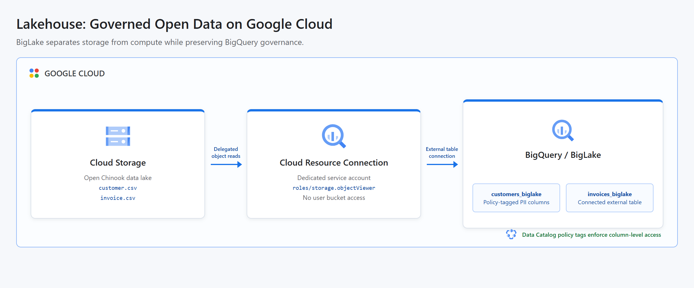

# Lakehouse: Qwik Start

This project recreates the Google Cloud Skills Boost GSP1040 Lakehouse lab as an automated, portfolio-ready pipeline. It downloads the open Chinook sample database, exports customer and invoice data to Cloud Storage, and queries those files through governed BigLake tables without loading them into BigQuery-managed storage. Terraform provisions the connection, least-privilege bucket access, dataset, external tables, and column-level policy tags.

## Cloud Architecture

[](docs/cloud-architecture.html)

Cloud Storage remains the system of record. A BigQuery Cloud Resource connection delegates object access to its own service account, and BigLake exposes the files through standard SQL. Data Catalog policy tags protect the customer address, postal code, and phone columns.

## Resources

- BigQuery, BigQuery Connection, Cloud Storage, and Data Catalog APIs
- Cloud Storage bucket containing generated `customer.csv` and `invoice.csv` objects
- BigQuery Cloud Resource connection with a managed service account
- Bucket-level `roles/storage.objectViewer` grant for the connection service account
- BigQuery dataset named `lakehouse_demo`
- BigLake table named `customers_biglake`
- Connected external table named `invoices_biglake`
- Data Catalog taxonomy and sensitive-data policy tag
- Column-level policy tags on customer address, postal code, and phone

All persistent demo resources have deletion enabled. Shared project APIs remain enabled after teardown to avoid disrupting other workloads.

## Data Source

The pipeline uses the [Chinook sample database](https://github.com/lerocha/chinook-database), an open-source digital media store dataset. Python downloads its SQLite database, exports only the Customer and Invoice tables as CSV, and uploads them to the data lake.

## Prerequisites

- Python 3.11 or newer with the `venv` module
- Terraform 1.6 or newer
- A Google Cloud project with billing enabled
- Application Default Credentials: `gcloud auth application-default login`
- Permissions to manage project services, Cloud Storage, BigQuery, BigQuery connections, IAM grants, and Data Catalog taxonomies

An identity needs Fine-Grained Reader access to the sensitive policy tag only when it queries the protected columns. Without that role, BigQuery intentionally rejects reads of `address`, `postal_code`, and `phone`; aggregate queries and queries excluding those columns continue to work.

## Run

```bash
chmod +x run.sh
GCP_PROJECT_ID="your-project-id" ./run.sh
```

The project ID can also be supplied as a positional argument:

```bash
./run.sh your-project-id
```

The default resource locations match the original lab: multi-region `US` for storage and analytics, and `us-central1` as the provider region. Override them when necessary:

```bash
GCP_PROJECT_ID="your-project-id" \
GCP_LOCATION="US" \
GCP_REGION="us-central1" \
./run.sh
```

The runner first creates the storage, governance, and connection resources. It then prepares and uploads the public data before a second Terraform apply creates the external tables. Finally, it checks row counts, invoice revenue, and both connection IDs.

Resources are destroyed automatically when the script finishes or fails. Terraform state remains local and may contain resource metadata, but no service account keys.

## Test

```bash
PYTHONPATH=. python3 -m unittest discover -s tests -v
terraform -chdir=terraform init -backend=false
terraform -chdir=terraform validate
```

## Concepts

| Concept | Definition + Use |
|---------|------------------|
| **Data Lake** | A storage layer for raw or lightly processed data, implemented here with CSV objects in Cloud Storage as the system of record. |
| **Lakehouse** | An architecture that combines data lake storage with warehouse-style querying and governance, implemented here through Cloud Storage, BigLake, and BigQuery. |
| **External Table** | A table whose data remains outside BigQuery-managed storage, used to query the Cloud Storage files with SQL. |
| **Delegated Access** | An access model in which a managed identity reads data on behalf of users, implemented with the BigQuery connection service account and bucket-level permissions. |
| **Column-Level Security** | A governance control that restricts access to sensitive columns, applied here to customer address, postal code, and phone data through policy tags. |