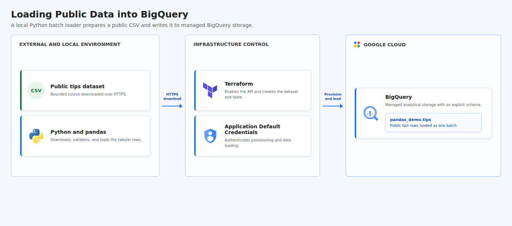

# Loading Public Data into BigQuery

This project uses pandas to download the public `tips` dataset and load it into a temporary BigQuery table. Terraform creates the GCP resources, and the Bash runner destroys them after the pipeline finishes or fails.

## Cloud Architecture

[](docs/cloud-architecture.html)

The local Python loader downloads the public `tips` CSV over HTTPS, prepares it with pandas, and loads the rows into the Terraform-provisioned BigQuery table using Application Default Credentials.

## Resources

- BigQuery API
- BigQuery dataset
- BigQuery table with an explicit schema

The BigQuery API remains enabled after cleanup because disabling a shared project API can affect other workloads. The dataset and table are destroyed.

## Prerequisites

- Python 3.9 or newer with the `venv` module
- Terraform 1.5 or newer
- A GCP project with billing enabled
- Application Default Credentials with permission to manage project services and BigQuery resources

On Debian or Ubuntu, install virtual environment support when needed:

```bash
sudo apt install python3-venv
```

Authenticate locally with:

```bash
gcloud auth application-default login
```

## Run

```bash
chmod +x run.sh
GCP_PROJECT_ID="your-project-id" ./run.sh
```

You can also pass the project ID as the first argument:

```bash
./run.sh your-project-id
```

Set a different BigQuery location when needed:

```bash
GCP_PROJECT_ID="your-project-id" GCP_LOCATION="southamerica-east1" ./run.sh
```

The script initializes and applies Terraform, creates a virtual environment, installs dependencies, loads the data, and runs `terraform destroy` through an exit trap. Terraform state remains local and contains no service account key.

## Concepts

| Concept | Definition + Use |
|---------|------------------|
| **Batch Ingestion** | A data-loading pattern that processes a bounded dataset in one operation, used here to load the public `tips` CSV into BigQuery. |
| **DataFrame** | An in-memory tabular data structure for reading and preparing data, provided here by pandas before the BigQuery load. |
| **Explicit Schema** | A predefined set of column names and data types, used to keep the BigQuery table structure predictable and validated. |
| **Managed Table** | A table whose data and storage lifecycle are managed by BigQuery, used here as the destination for the loaded rows. |
| **Infrastructure as Code** | The practice of defining cloud resources declaratively, used here through Terraform to create and destroy the BigQuery resources. |