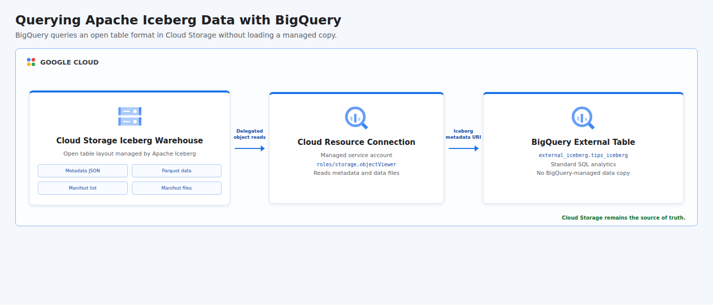

# Querying External Data and Iceberg Tables

This project creates an Apache Iceberg table from the public Seaborn Tips dataset, stores its Parquet data, manifests, and metadata in Cloud Storage, and registers the current Iceberg metadata file as a BigQuery external table. It demonstrates interoperable lakehouse querying: BigQuery runs standard SQL over Iceberg data while Cloud Storage remains the system of record and no managed BigQuery copy is created.

## Cloud Architecture

[](docs/cloud-architecture.html)

PyIceberg writes the open table layout to Cloud Storage. A BigQuery Cloud Resource connection delegates object reads to a dedicated managed service account, and the external table resolves Iceberg metadata to the underlying Parquet files.

## Resources

- BigQuery, BigQuery Connection, and Cloud Storage APIs
- Cloud Storage bucket containing the Iceberg warehouse
- Iceberg metadata JSON, manifest list, manifest files, and Parquet data objects
- BigQuery dataset named `external_iceberg`
- BigQuery Cloud Resource connection named `iceberg-cloud-resource`
- Bucket-level `roles/storage.objectViewer` grant for the connection service account
- BigQuery external table named `tips_iceberg` with `ICEBERG` source format

All persistent demo resources allow deletion. Shared project APIs remain enabled after teardown to avoid disrupting other workloads.

## Data Source

The pipeline uses the open [Seaborn Tips dataset](https://github.com/mwaskom/seaborn-data), which contains 244 restaurant transactions with bill, tip, party, day, time, smoker, and customer-group fields. The writer assigns a stable `tip_id`, applies explicit Arrow and Iceberg types, and commits one Iceberg snapshot.

## Prerequisites

- Python 3.11 or newer with the `venv` module
- Terraform 1.6 or newer
- A Google Cloud project with billing enabled
- Application Default Credentials: `gcloud auth application-default login`
- Permissions to manage project services, Cloud Storage, BigQuery datasets, BigQuery connections, and bucket IAM
- Object creation permission in the generated Cloud Storage bucket

## Run

```bash
chmod +x run.sh
GCP_PROJECT_ID="your-project-id" ./run.sh
```

The project ID can also be supplied as a positional argument. Override the default locations when needed:

```bash
GCP_REGION="us-central1" \
GCP_LOCATION="US" \
./run.sh your-project-id
```

The runner first creates the bucket, dataset, and delegated connection. It then downloads the public data, writes an Iceberg table, passes the current metadata JSON URI into a second Terraform apply, and queries the resulting external table. Verification requires 244 rows, four service days, and a total bill value of `4827.77`.

Resources are destroyed automatically when the script finishes or fails. The local SQLite catalog is temporary and removed during cleanup; the portable Iceberg metadata and data files are stored in Cloud Storage for the duration of the run.

## Test

```bash
PYTHONPATH=. python3 -m unittest discover -s tests -v
terraform -chdir=terraform init -backend=false
terraform -chdir=terraform validate
bash -n run.sh
```

## Concepts

| Concept | Definition + Use |
|---------|------------------|
| **Open Table Format** | A vendor-neutral specification for organizing analytical tables, implemented with Apache Iceberg metadata and Parquet files. |
| **External Table** | A queryable table whose data remains outside BigQuery-managed storage, used here to analyze the Cloud Storage Iceberg warehouse. |
| **Table Metadata** | Structured information that maps a logical table to schemas, snapshots, manifests, and data files, resolved from the current Iceberg metadata JSON. |
| **Snapshot** | An immutable table state committed atomically by Iceberg, created when PyIceberg writes the Tips records. |
| **Manifest** | An Iceberg metadata file that tracks data files and partition statistics, used by query engines to plan reads without listing the warehouse. |
| **Schema-on-Read** | Interpretation of externally stored data when queried, applied by BigQuery through the Iceberg schema rather than a data load job. |
| **Delegated Access** | An access model in which a managed identity reads data on behalf of users, implemented by the BigQuery connection service account. |