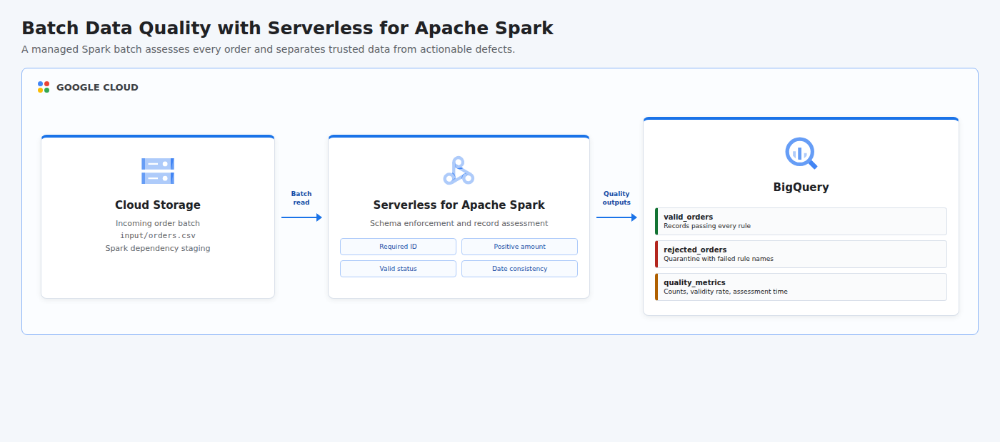

# Validate Data Quality for a Batch Data Pipeline Using Serverless for Apache Spark

This project uses Google Cloud Serverless for Apache Spark to assess a deterministic batch of order records before analytics consumption. The Spark job enforces required identifiers, positive amounts, valid status values, and chronological delivery dates, then writes trusted records, quarantined failures with rule-level diagnostics, and aggregate quality metrics to separate BigQuery tables.

## Cloud Architecture

[](docs/cloud-architecture.html)

Cloud Storage holds the incoming batch and Spark staging objects. Serverless for Apache Spark supplies ephemeral managed compute, and BigQuery stores the three quality outcomes for downstream analysis, remediation, and monitoring.

## Resources

- BigQuery, Dataproc, IAM, and Cloud Storage APIs
- Cloud Storage bucket containing the input CSV and Spark dependency objects
- BigQuery dataset named `batch_data_quality`
- `valid_orders` table containing records that pass every rule
- `rejected_orders` quarantine table containing an array of failed rule names
- `quality_metrics` table containing total, valid, rejected, validity rate, and assessment timestamp
- Dedicated `spark-quality-runner` service account
- Project-level BigQuery Job User and Dataproc Worker grants for the Spark identity
- Bucket-level Object Admin and dataset-level Data Editor grants
- Service Account User grant allowing the authenticated runner to submit the batch
- Temporary Serverless for Apache Spark batch workload

All persistent demo resources allow deletion. Shared project APIs remain enabled after teardown to avoid disrupting other workloads.

## Input And Rules

The generated batch contains ten fictional orders and four intentional defects. Keeping the input deterministic makes the expected quality profile reproducible without relying on a mutable external API.

| Rule | Requirement | Rejected Example |
|------|-------------|------------------|
| `customer_id_required` | Customer ID must be present and nonblank. | `O-1004` |
| `amount_positive` | Order amount must be greater than zero. | `O-1008` |
| `status_valid` | Status must belong to the approved business domain. | `O-1007` |
| `delivery_not_before_order` | Delivery must be absent or occur on or after the order date. | `O-1005` |

The expected result is ten assessed records, six valid records, four rejected records, and a validity rate of 60 percent.

## Prerequisites

- Python 3.11 or newer with the `venv` module
- Terraform 1.6 or newer
- Google Cloud CLI (`gcloud`)
- A Google Cloud project with billing enabled
- CLI authentication: `gcloud auth login`
- Application Default Credentials: `gcloud auth application-default login`
- Permissions to manage project services, Cloud Storage, BigQuery, service accounts, IAM grants, and Dataproc batches

## Run

```bash
chmod +x run.sh
GCP_PROJECT_ID="your-project-id" ./run.sh
```

The project ID can also be passed as an argument. Override the default regional placement when needed:

```bash
GCP_REGION="us-central1" ./run.sh your-project-id
```

The runner provisions the resources, generates and uploads the batch, submits the PySpark workload, and verifies all three output tables and all four failed-rule categories. Resources are destroyed automatically when the script finishes or fails. Serverless Spark batches can take several minutes to allocate and complete.

## Test

```bash
PYTHONPATH=. python3 -m unittest discover -s tests -v
terraform -chdir=terraform init -backend=false
terraform -chdir=terraform validate
bash -n run.sh
```

## Concepts

| Concept | Definition + Use |
|---------|------------------|
| **Data Quality Rule** | A testable requirement for acceptable data, implemented for completeness, validity, positivity, and date consistency. |
| **Validity** | The degree to which values conform to allowed formats or domains, measured here through status, amount, and date rules. |
| **Completeness** | The presence of required data, checked by rejecting missing or blank customer identifiers. |
| **Quarantine** | Isolation of invalid records from trusted output, implemented with `rejected_orders` and its failed-rule diagnostics. |
| **Quality Metric** | A quantitative summary of dataset health, represented by record counts and the 60 percent validity rate. |
| **Batch Processing** | Processing a bounded collection as one workload, used to assess the complete order CSV with Spark. |
| **Serverless Compute** | On-demand execution without cluster management, supplied by Serverless for Apache Spark for the validation job. |