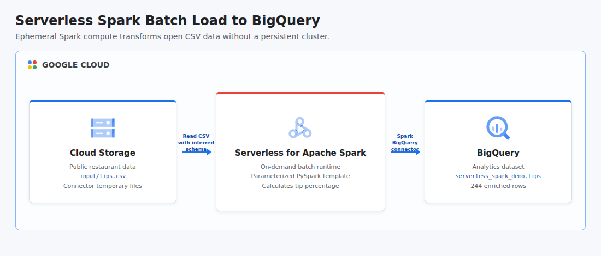

# Use Serverless for Apache Spark to Load BigQuery

This project turns the Google Cloud hands-on lab into an automated, portfolio-ready batch pipeline. It downloads the public Seaborn tips dataset, stores the CSV in Cloud Storage, runs a parameterized PySpark template on Serverless for Apache Spark, enriches each row with a tip percentage, loads the result into BigQuery, and verifies the output before removing all demo resources.

## Cloud Architecture

[](docs/cloud-architecture.html)

Cloud Storage holds the source CSV and temporary connector files. Dataproc Serverless supplies ephemeral Spark compute, so there is no cluster to create or manage, and the Spark BigQuery connector writes the transformed rows into the analytics dataset.

## Resources

- Dataproc, BigQuery, Cloud Storage, and IAM APIs
- Cloud Storage bucket for input data, batch staging, and temporary connector files
- BigQuery dataset named `serverless_spark_demo`
- Serverless Spark execution service account
- Least-privilege bucket, dataset, BigQuery job, and Dataproc worker IAM grants
- BigQuery table named `tips`, created by the Spark connector during the batch

All persistent demo resources allow deletion. Shared project APIs remain enabled after teardown to avoid disrupting other workloads.

## Data Source

The pipeline uses the public [Seaborn tips dataset](https://github.com/mwaskom/seaborn-data), containing 244 restaurant transactions with bill, tip, party, day, and service attributes.

## Prerequisites

- Python 3.11 or newer with the `venv` module
- Terraform 1.6 or newer
- Google Cloud CLI with an active account
- A Google Cloud project with billing enabled
- Application Default Credentials: `gcloud auth application-default login`
- Permissions to enable APIs and manage Cloud Storage, BigQuery, Dataproc batches, service accounts, and IAM policies

## Run

```bash
chmod +x run.sh
GCP_PROJECT_ID="your-project-id" ./run.sh
```

The project ID can also be supplied as a positional argument:

```bash
./run.sh your-project-id
```

The default region is `us-central1`. Override it when needed:

```bash
GCP_PROJECT_ID="your-project-id" GCP_REGION="southamerica-east1" ./run.sh
```

The runner provisions the infrastructure, uploads the public CSV, submits the PySpark template, waits for the serverless batch, and checks row count and aggregate values in BigQuery. Resources are destroyed automatically when the script finishes or fails.

## Test

```bash
PYTHONPATH=. python3 -m unittest discover -s tests -v
terraform -chdir=terraform init -backend=false
terraform -chdir=terraform validate
```

## Concepts

| Concept | Definition + Use |
|---------|------------------|
| **Serverless Compute** | An execution model that allocates and releases infrastructure on demand, used here to run Spark without managing a cluster. |
| **Batch Processing** | Bounded data processing that runs to completion, used to transform the restaurant CSV and load one BigQuery table. |
| **Data Lake Staging** | Object storage used as a durable handoff between pipeline stages, implemented with Cloud Storage for source and temporary files. |
| **Schema Inference** | Automatic discovery of column types from source data, used by Spark when reading the CSV header and values. |
| **Data Enrichment** | Deriving new information from source fields, used to calculate `tip_percentage` before loading BigQuery. |
| **Idempotent Load** | A repeatable write strategy that avoids duplicate results, implemented with Spark overwrite mode. |