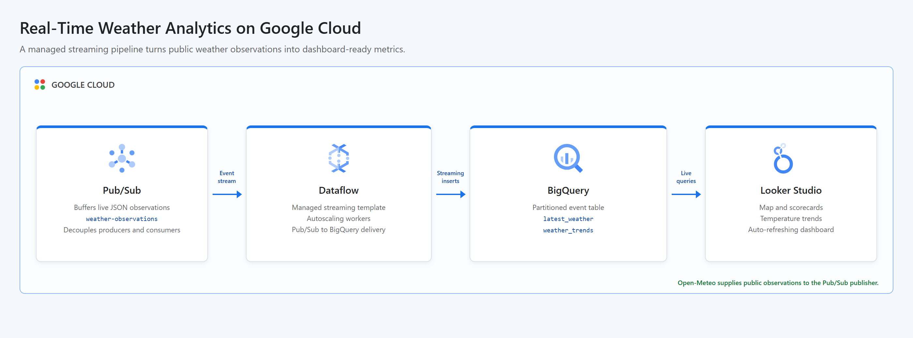

# Creating a Streaming Data Pipeline for a Real-Time Dashboard with Dataflow

This project turns live weather observations from the free Open-Meteo API into dashboard-ready analytics on Google Cloud. A Python producer publishes JSON events for five global cities to Pub/Sub, the Google-provided Dataflow streaming template delivers them continuously to a partitioned BigQuery table, and two SQL views expose current conditions and 24-hour trends for Looker Studio.

## Cloud Architecture

[](docs/cloud-architecture.html)

Pub/Sub absorbs changes in producer and consumer throughput, while Dataflow provides managed streaming execution. BigQuery stores raw history and computes dashboard views without a separate serving database.

## Resources

- BigQuery, Compute Engine, Dataflow, IAM, Pub/Sub, and Cloud Storage APIs
- Pub/Sub topic named `weather-observations`
- Cloud Storage bucket for Dataflow staging and temporary objects
- BigQuery dataset named `streaming_weather`
- Partitioned and city-clustered `weather_events` table
- `latest_weather` view with the newest observation for every city
- `weather_trends` view with minute-level metrics from the last 24 hours
- Dedicated Dataflow worker service account
- Worker IAM grants for Dataflow, Pub/Sub, BigQuery, and staging object access
- A temporary Dataflow streaming job launched from Google's managed template

All persistent demo resources allow deletion. Shared project APIs remain enabled after teardown so other workloads are not disrupted.

## Data Source

[Open-Meteo](https://open-meteo.com/) provides current temperature, humidity, wind speed, and WMO weather codes without an API key. Each publishing cycle collects observations for Sao Paulo, New York, London, Tokyo, and Sydney.

## Prerequisites

- Python 3.11 or newer with the `venv` module
- Terraform 1.6 or newer
- Google Cloud CLI (`gcloud`)
- A Google Cloud project with billing enabled
- Application Default Credentials: `gcloud auth application-default login`
- CLI authentication: `gcloud auth login`
- Permissions to manage project services, IAM, Pub/Sub, Cloud Storage, BigQuery, service accounts, and Dataflow jobs
- Permission to act as the generated `streaming-dataflow-worker` service account

## Run

```bash
chmod +x run.sh
GCP_PROJECT_ID="your-project-id" ./run.sh
```

The project ID can also be passed as an argument. Region, BigQuery location, publishing cycles, and interval are configurable:

```bash
GCP_REGION="us-central1" \
GCP_LOCATION="US" \
PUBLISH_CYCLES="6" \
PUBLISH_INTERVAL="30" \
./run.sh your-project-id
```

The runner provisions the resources, launches the managed `PubSub_to_BigQuery` Dataflow template, publishes observations, and verifies the expected row count. It then cancels the streaming job and destroys all Terraform-managed resources automatically, whether the run succeeds or fails.

Dataflow startup can take several minutes. The default run publishes 15 events and waits up to five minutes for BigQuery delivery after the job reaches the `Running` state.

## Dashboard

During the verification window, create a Looker Studio BigQuery data source using the `streaming_weather.latest_weather` view for a geographic map and scorecards. Use `streaming_weather.weather_trends` for time-series charts grouped by `city`. Looker Studio is configured interactively and is intentionally not destroyed by Terraform, so the project leaves dashboard creation outside the automated demo lifecycle.

## Test

```bash
PYTHONPATH=. python3 -m unittest discover -s tests -v
terraform -chdir=terraform init -backend=false
terraform -chdir=terraform validate
bash -n run.sh
```

## Concepts

| Concept | Definition + Use |
|---------|------------------|
| **Event Streaming** | A continuous data movement model, used to send weather observations from Pub/Sub through Dataflow as they arrive. |
| **Message Broker** | A durable intermediary that decouples producers from consumers, implemented with Pub/Sub to absorb variable event rates. |
| **Stream Processing** | Continuous computation and delivery over unbounded data, implemented by the managed Dataflow streaming job. |
| **Event Time** | The time an observation occurred at its source, stored in `observed_at` and used to partition and order weather data. |
| **Partitioning** | Physical table organization by a key, applied by observation date to reduce BigQuery scan cost. |
| **Clustering** | Co-location of related table rows, applied by city to improve city-filtered dashboard queries. |
| **Serving View** | A curated query interface over stored data, used to expose latest conditions and recent trends to Looker Studio. |